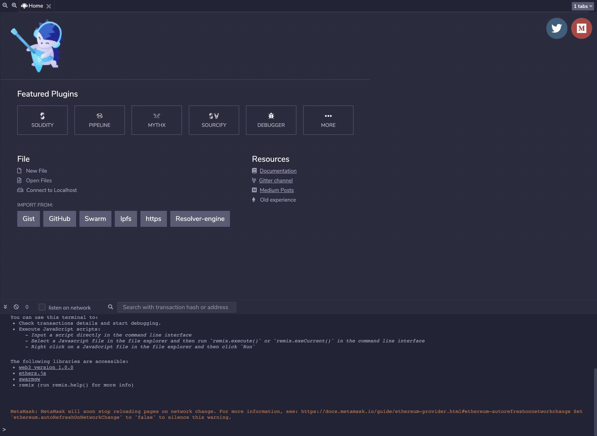
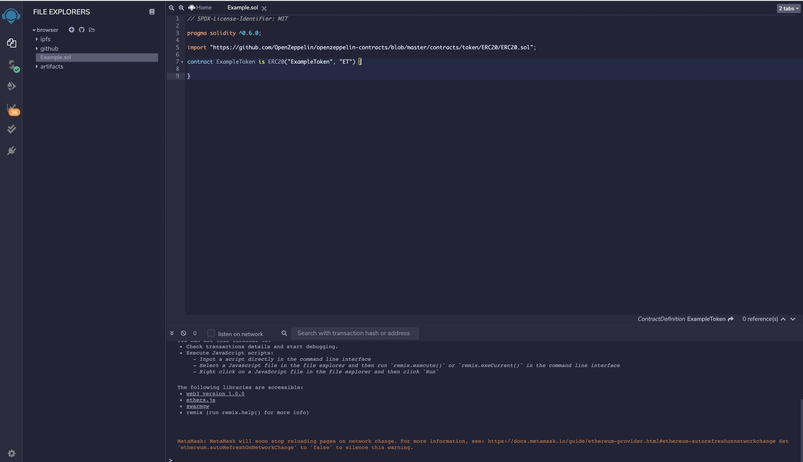
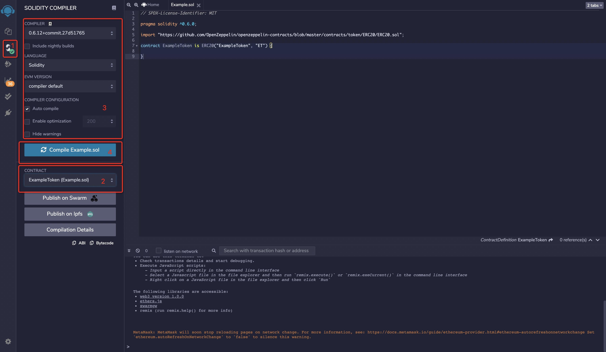
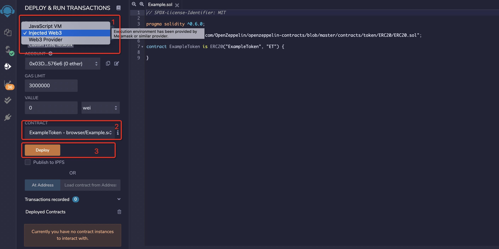

# Contract
`Heco` use `EVM` for contract execution.See [Solidity](https://docs.soliditylang.org/en/v0.7.1/#) for detail.

## Remix

[Remix IDE](https://remix.ethereum.org) is an open source web and desktop application. It fosters a fast development cycle and has a rich set of plugins with intuitive GUIs. Remix is used for the entire journey of contract development as well as being a playground for learning and teaching contract development.


Create new file in file explorer. Edit contract info at right side.


Compile contract
1. Click compiler button, switch UI
2. Select contract you want to compile
3. Set compile flags
4. Clieck compile button



Deploy contract to blockchain via wallet such as `MetaMask`.
1. Set network info in `Metamask`.


2. Back to `Remix`.
+ Swich environment
+ Select contract
+ click deploy button



通过`MetaMask`即可将合约部署上链了


## Truffle
Use truffle to compile and deploy contract.
+ Install Node.js
See [Installing Node.js](https://nodejs.org/en/download/package-manager/) for detail.

+ Install truffle
```
npm install -g truffle
```
Run `truffle version` after installation finished. If the command line displays a message like below, installation is successful.

```
Truffle v5.1.36 (core: 5.1.36)
Solidity v0.5.16 (solc-js)
Node v10.22.1
Web3.js v1.2.1
```
+ Create project

First,create folder for project.
```
mkdir Example
cd Example
```

Then, init project via truffle
```
truffle init
```
After initialization is complete, the following file structure is generated within the project.
```
|-- contracts         //folder for contracts
|-- migrations        //folder for deployment scripts
|-- test              //folder for test scripts
|-- truffle-config.js //truffle config file
```
+ Config truffle info

```
const HDWalletProvider = require('@truffle/hdwallet-provider');

const fs = require('fs');
const mnemonic = fs.readFileSync(".secret").toString().trim();

module.exports = {
  networks: {
    testnet: {
      provider: () => new HDWalletProvider(mnemonic, 'https://http-testnet.hecochain.com'),
      network_id: 256
    },
    mainnet: {
      provider: () => new HDWalletProvider(mnemonic, 'https://http-mainnet.hecochain.com'),
      network_id: 128
    }
  },

  // Set default mocha options here, use special reporters etc.
  mocha: {
    // timeout: 100000
  },

  // Configure your compilers
  compilers: {
    solc: {
      // version: "0.5.1",    // Fetch exact version from solc-bin (default: truffle's version)
      // docker: true,        // Use "0.5.1" you've installed locally with docker (default: false)
      // settings: {          // See the solidity docs for advice about optimization and evmVersion
      //  optimizer: {
      //    enabled: false,
      //    runs: 200
      //  },
      //  evmVersion: "byzantium"
      // }
    },
  },
};

```
+ Create contract
Put custom contracts into folder `contracts` and modify deployment script in folder `migrations`.

+ Deploy contract

Run the deployment command.
```
truffle migrate --network testnet
```
The output as below.
```
2_example_migration.js
======================

   Deploying 'ExampleToken'
   ------------------------
   > transaction hash:    0x91e50594a63bc6f4c299f3f445868571678be306b835bddce6dff5c7a5ddf9dc
   > Blocks: 2            Seconds: 4
   > contract address:    0x54D2049715FC8De1361D7350de90eb05F0f6CA84
   > block number:        375304
   > block timestamp:     1608016637
   > account:             0x03D32B774295D740ffEe43b20fcC0a53acC576e6
   > balance:             878.909609236165318643
   > gas used:            1056044 (0x101d2c)
   > gas price:           20 gwei
   > value sent:          0 ETH
   > total cost:          0.02112088 ETH


   > Saving migration to chain.
   > Saving artifacts
   -------------------------------------
   > Total cost:          0.02112088 ETH


Summary
=======
> Total deployments:   1
> Final cost:          0.02112088 ETH
```
Finally, the contract deployment is complete.
