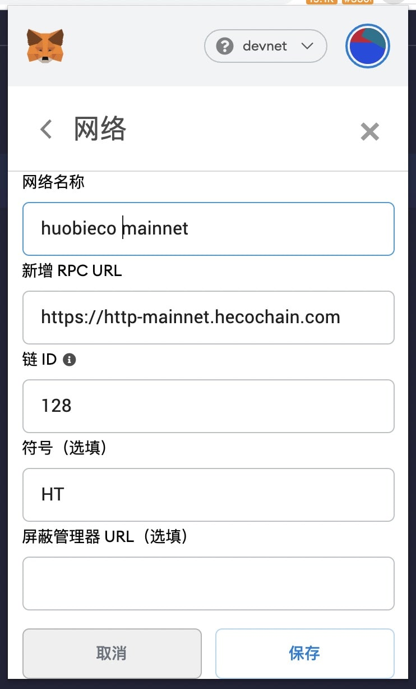

# 智能合约操作
`Heco`使用`EVM`作为虚拟机，全面兼容以太坊合约开发。具体开发文档参见[Solidity](https://docs.soliditylang.org/en/v0.7.1/#)


## 使用Remix部署合约
[Remix](https://remix.ethereum.org)是在线的合约开发和部署工具。首先打开`Remix`页面


左侧文件浏览器内，新建文件，比如`Example.sol`，在右侧编辑合约内容。


编译合约
1. 点击左侧按钮，切换到编译界面；
2. 选择对应的合约；
3. 设置相关的编译选项；
4. 点击编译按钮进行编译；


接下来要将编译后的合约部署到链上，这里需要借助浏览器钱包插件。以`MetaMask`为例。

1. 设置网络信息，设置完成后保存。



2. 返回到`Remix`界面
+ 切换环境
+ 选择对应合约
+ 点击部署按钮


通过`MetaMask`即可将合约部署上链了


## 使用Truffle部署合约
+ 安装 Node

具体操作可查看[Installing Node.js](https://nodejs.org/en/download/package-manager/)

+ 安装truffle
```
npm install -g truffle
```
安装完成后执行以下命令
```
truffle version
```
如果命令行显示，以下类似信息，则表示安装成功。
```
Truffle v5.1.36 (core: 5.1.36)
Solidity v0.5.16 (solc-js)
Node v10.22.1
Web3.js v1.2.1
```
+ 创建项目

首先创建项目文件夹
```
mkdir Example
cd Example
```

然后使用truffle初始化项目
```
truffle init
```
初始化完成后，项目内会生成以下文件结构
```
|-- contracts         //文件夹，用于放置合约文件
|-- migrations        //文件夹，用于放置部署脚本
|-- test              //文件夹，用于放置测试文件
|-- truffle-config.js //此项目的 truffle 配置文件
```
+ 配置Truffle信息

```
const HDWalletProvider = require('@truffle/hdwallet-provider');

const fs = require('fs');
const mnemonic = fs.readFileSync(".secret").toString().trim();

module.exports = {
  networks: {
    testnet: {
      provider: () => new HDWalletProvider(mnemonic, 'https://http-testnet.hecochain.com'),
      network_id: 256
    },
    mainnet: {
      provider: () => new HDWalletProvider(mnemonic, 'https://http-mainnet.hecochain.com'),
      network_id: 128
    }
  },

  // Set default mocha options here, use special reporters etc.
  mocha: {
    // timeout: 100000
  },

  // Configure your compilers
  compilers: {
    solc: {
      // version: "0.5.1",    // Fetch exact version from solc-bin (default: truffle's version)
      // docker: true,        // Use "0.5.1" you've installed locally with docker (default: false)
      // settings: {          // See the solidity docs for advice about optimization and evmVersion
      //  optimizer: {
      //    enabled: false,
      //    runs: 200
      //  },
      //  evmVersion: "byzantium"
      // }
    },
  },
};

```
+ 编写合约

将自定义的合约放置到`contracts`文件夹内，并修改`migrations`中的部署脚本

+ 部署合约

运行部署命令
```
truffle migrate --network testnet
```
输出结果如下
```
2_example_migration.js
======================

   Deploying 'ExampleToken'
   ------------------------
   > transaction hash:    0x91e50594a63bc6f4c299f3f445868571678be306b835bddce6dff5c7a5ddf9dc
   > Blocks: 2            Seconds: 4
   > contract address:    0x54D2049715FC8De1361D7350de90eb05F0f6CA84
   > block number:        375304
   > block timestamp:     1608016637
   > account:             0x03D32B774295D740ffEe43b20fcC0a53acC576e6
   > balance:             878.909609236165318643
   > gas used:            1056044 (0x101d2c)
   > gas price:           20 gwei
   > value sent:          0 ETH
   > total cost:          0.02112088 ETH


   > Saving migration to chain.
   > Saving artifacts
   -------------------------------------
   > Total cost:          0.02112088 ETH


Summary
=======
> Total deployments:   1
> Final cost:          0.02112088 ETH
```
至此，合约部署完成。

