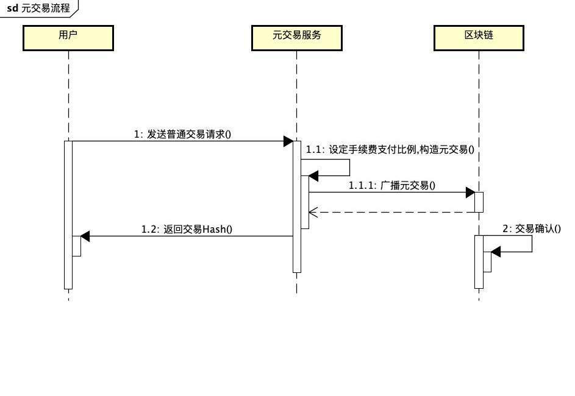

# 元交易
元交易功能本质上是实现手续费代付的操作。`Address1` 将要发送的交易交给`Address2`， `Address2` 将费用扣除相关的信息进行签名，放置在交易的`data`数据段内广播发送，区块链根据规则对交易进行处理。



## 元交易构造
- 获取原始的`rawTransaction`信息；
- 解析原始交易信息，获取`nonce` `gasprice` `gaslimit` `from address` `to address` `value` `data`；
- 将上述字段以及手续费折扣比例等信息，进行RLP编码，示例如下：
```Java
    List<RlpType> result = new ArrayList();
    result.add(RlpString.create(nonce));
    result.add(RlpString.create(gasPrice));
    result.add(RlpString.create(gasLimit));
    result.add(RlpString.create(receiveAddress));

    result.add(RlpString.create(value));
    result.add(RlpString.create(data));
    result.add(RlpString.create(sendAddress));
    result.add(RlpString.create(feePercent));
    result.add(RlpString.create(blockNumber));
    result.add(RlpString.create(chainId));

    RlpList rlpList = new RlpList(result);
    this.rlpEncodeData = RlpEncoder.encode(rlpList);
```
- 由手续费代付地址对上述数据进行签名；
- 使用签名数据替换原始交易中的`data`信息，重新Encode为`rawTransaction`;
- 广播交易信息到链上；

## 官方元交易服务
火币官方提供元交易服务，根据调用者的`HT`持仓量，进行手续费补贴。

### API

https://meta-mainnet.hecochain.com

- 计算补贴费率
  
>  POST /meta/fee
 ```JSON
 {
    "from": "0x0000000000000000000000000000000000000000", // from addr
    "to": "0x0000000000000000000000000000000000000001", // to addr
    "value": "1", // transfer value
    "nonce": "0", //from nonce
    "data": "0x0" // tx input data
}
 ```
 Response
```JSON
{
   "status": 1, // 0:failed, 1:success
   "message": "success", //sucess or error
   "data": 0 // fee rate
}
```

- 签名并广播元交易

> POST /meta/tx
```JSON
{
    “0xdddd” // 签名好的交易的 hex raw data
}
```
Response
```JSON
{
   "status": 1, // 0:failed, 1:success
   "message": "success", //sucess or error
   "data": "0x0000000000" // hash
}
```