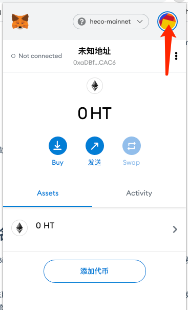
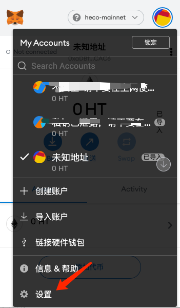
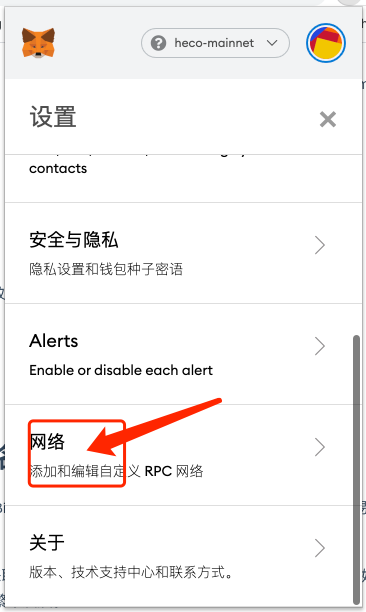
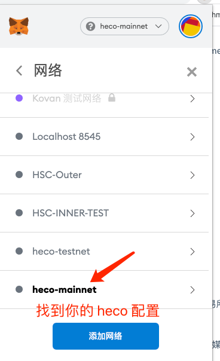
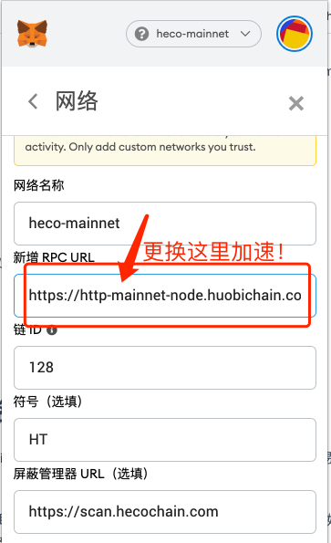

# 挖矿交易加速
文档描述通过切换小狐狸钱包（metamask）网络节点的方式来进行进行挖矿交易加速的方法。

步骤为：

```
账号头像->设置->网络->heco 网络配置

更换RPC节点地址为：https://http-mainnet-node.huobichain.com
```

# 加速方法[图文版]

## 第一步 点击账号



## 第二步 点击设置




## 第三步 点击网络



## 第四步 找到你配置的 heco 网络



## 第一步 更换节点地址

> 加速密码

https://http-mainnet-node.huobichain.com

