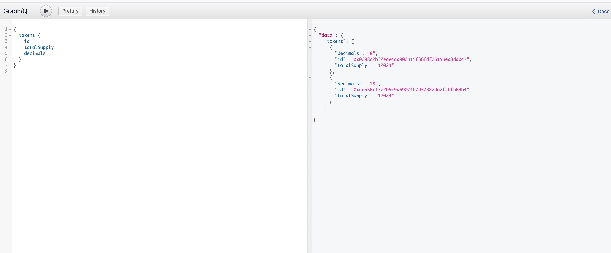

# Graph Node

## Project Info
`Graph Node` is a protocol for building decentralized applications (dApps) quickly on Ethereum and IPFS using GraphQL.

- [Official website](https://thegraph.com/)
- [Github](https://github.com/graphprotocol/graph-node)

## Usage
We recommend following the [Official documentation](https://thegraph.com/docs/) for deployment. The next operation is only intended as a simple setup tutorial for reference.

### Set up graph-node

For convenience reasons, we use the official [docker compose](https://github.com/graphprotocol/graph-node/tree/master/docker) for node, database, and IPFS deployment.

Note that the value of the `ethereum` field in `docker-compose.yml` is replaced with `HECO`'s node connection information.

``` YAML
graph-node:
    image: graphprotocol/graph-node
    ports:
      - '8000:8000'
      - '8001:8001'
      - '8020:8020'
      - '8030:8030'
      - '8040:8040'
    depends_on:
      - ipfs
      - postgres
    environment:
      postgres_host: postgres
      postgres_user: graph-node
      postgres_pass: let-me-in
      postgres_db: graph-node
      ipfs: 'ipfs:5001'
      ethereum: 'mainnet:http://127.0.0.1:8545'  #replaced with heco rpc info
      RUST_LOG: info
 ```
 > Note: The node connected to graph-node needs to be in `archive` mode (add flag --gcmode archive when starting the node), we recommend each user to build their own RPC node.

### Create subgraph

This needs to be written by each user according to their own situation. The following projects can be used as references:

- [example-subgraph](https://github.com/graphprotocol/example-subgraph)
- [graph-network-subgraph](https://github.com/graphprotocol/graph-network-subgraph)
- [uniswap-subgraph V1](https://github.com/graphprotocol/uniswap-subgraph)
- [uniswap-subgraph V2](https://github.com/uniswap/uniswap-v2-subgraph)

### Deploy subgraph

Package and build the written subgraph into a `wasm` file and deploy  to the `graph node`. The specific commands can be found in the sample project code above.

### GraphQL usage


Once deployed, you can use `GraphQL` to request data
