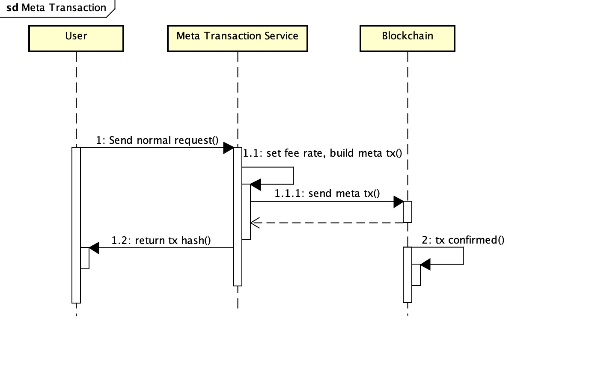
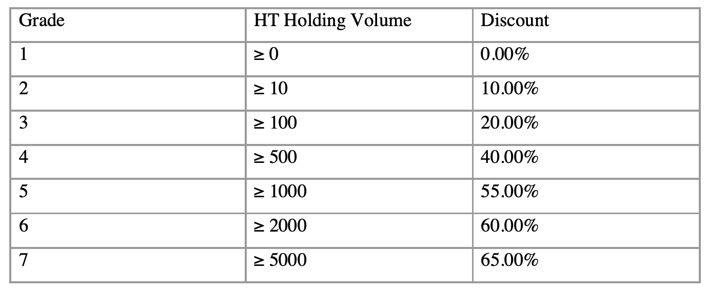

# Meta transaction
A meta-transaction is essentially an operation that fulfils a fee payment in proxy. `Address1` gives the transaction to be sent to `Address2`. And `Address2` signs the information related to the fee deduction and places it in the `data` data segment of the transaction. The transaction is then broadcast and the blockchain processes the transaction according to the rules.



# Java Demo 

https://github.com/HuobiGroup/metatx-Java-demo

## Build meta transaction
- Obtain the original `rawTransaction` information.
- Parse raw transaction to get fields like `nonce`, `gasprice`, `gaslimit`, `from address`, `to address`, `value`, `data`, etc.
- Take the above fields, as well as the fee discount percentage and other fields, and encode them in RLP format as follows for example.
```Java
    List<RlpType> result = new ArrayList();
    result.add(RlpString.create(nonce));
    result.add(RlpString.create(gasPrice));
    result.add(RlpString.create(gasLimit));
    result.add(RlpString.create(receiveAddress));

    result.add(RlpString.create(value));
    result.add(RlpString.create(data));
    result.add(RlpString.create(sendAddress));
    result.add(RlpString.create(feePercent));
    result.add(RlpString.create(blockNumber));
    result.add(RlpString.create(chainId));

    RlpList rlpList = new RlpList(result);
    this.rlpEncodeData = RlpEncoder.encode(rlpList);
```
- Sign the above data by the fee proxy address.
- Replace the `data` filed in the original transaction with the signed data and re-encode it as `rawTransaction`.
- Broadcast `rawTransaction` to blockchain；

## Official Meta Transaction Service
Huobi officially provides a meta transaction service with a fee subsidy based on the caller's `HT` holdings.



### API

https://meta-mainnet.hecochain.com

- Calculate the rate of subsidy
  
>  POST /meta/fee
 ```JSON
 {
    "from": "0x0000000000000000000000000000000000000000", // from addr
    "to": "0x0000000000000000000000000000000000000001", // to addr
    "value": "1", // transfer value
    "nonce": "0", //from nonce
    "data": "0x0" // tx input data
}
 ```
 Response
```JSON
{
   "status": 1, // 0:failed, 1:success
   "message": "success", //sucess or error
   "data": 0 // fee rate
}
```

- Sign and broadcast tx

> POST /meta/tx
```JSON
{
    "raw": "0xdddd" // signed tx hex raw data
}
```
Response
```JSON
{
   "status": 1, // 0:failed, 1:success
   "message": "success", //sucess or error
   "data": "0x0000000000" // hash
}
```