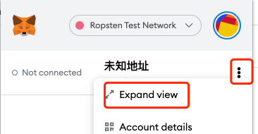

# Metamask Lagging 

Slow response when inputting tansfer amount, fetching gasprice, etc. It is a chrome's known issue according to the following issue：

https://github.com/MetaMask/metamask-extension/issues/10202

Workarounds are:

1）Use expand view

2）Move to primary monitor is using multiple monitors

3）Use other explorers
