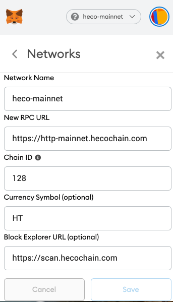

# Summary

Heco support metamask、huobi wallet app、huobi wallet extension

# metamask

add custom network：

## mainnet

download url：https://metamask.io/

```
chainid: 128
rpc: https://http-mainnet.hecochain.com
scan: https://scan-mainnet.hecochain.com
```



## testnet

```
chainid: 256
rpc: https://http-testnet.hecochain.com
scan: https://scan-testnet.hecochain.com
```

# huobi wallet app

https://www.huobiwallet.com/

# huobi wallet extension

> to release soon
