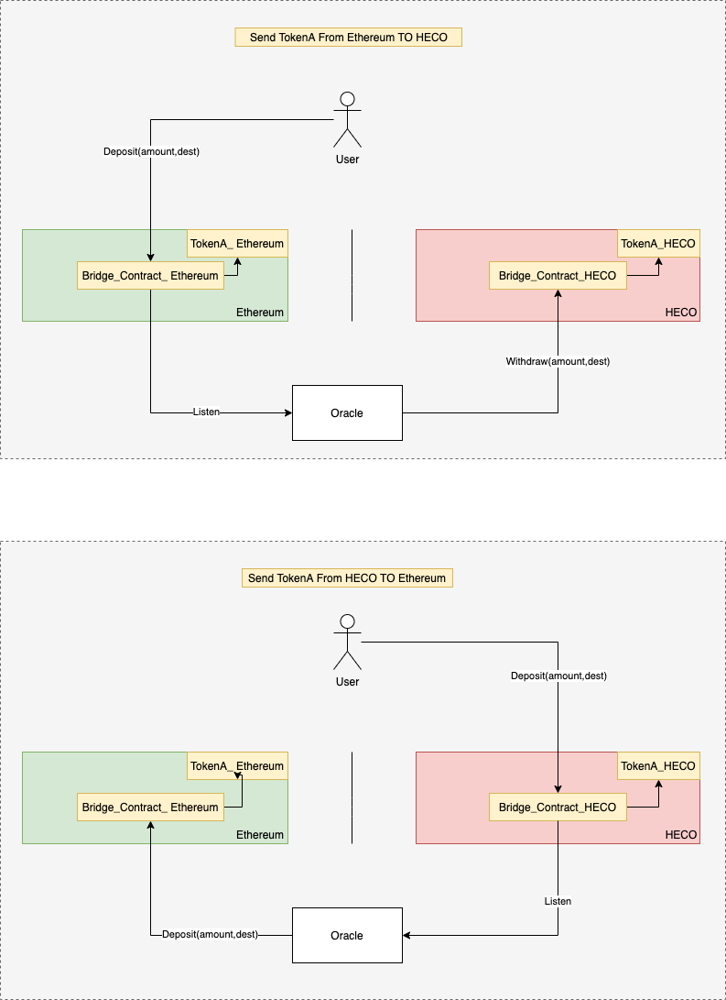

# 概况
本文档描述了 heco bridge 资产跨链桥的工作原理。

合约地址：

Ethereum： [0xa929022c9107643515f5c777ce9a910f0d1e490c](https://etherscan.io/address/0xa929022c9107643515f5c777ce9a910f0d1e490c)

HECO: [0xa929022c9107643515f5c777ce9a910f0d1e490c](https://scan.hecochain.com/address/0xa929022c9107643515f5c777ce9a910f0d1e490c)

# 工作原理

# 申请 Token 跨链

流程如下：

1）提出申请

联系商务或者联系 <devcontacts@huobi.com>

2）桥部署 Token 合约

3）测试

4）上线