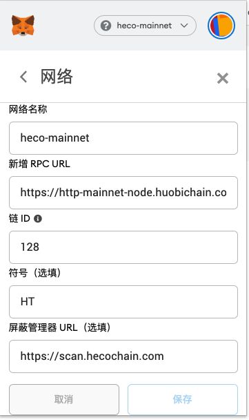

# 概况

支持 metamask、huobi wallet app、huobi wallet 浏览器插件

> 注意：提现到钱包之前，请检查兼容性，已知 Ledger 暂未支持

# metamask

下载地址：https://metamask.io/

添加自定义网络：

## 主网

```
chainid: 128
rpc: https://http-mainnet.hecochain.com
scan: https://scan.hecochain.com
```

国内访问 rpc 可以选择：
```
https://http-mainnet-node.huobichain.com
https://http-mainnet-node1.hecochain.com
```



## 测试网

```
chainid: 256
rpc: https://http-testnet.hecochain.com
scan: https://scan-testnet.hecochain.com
```


# huobi wallet app

https://www.huobiwallet.com/

# huobi wallet extension

> 待公布

# Heco cointtype

https://github.com/satoshilabs/slips/blob/master/slip-0044.md